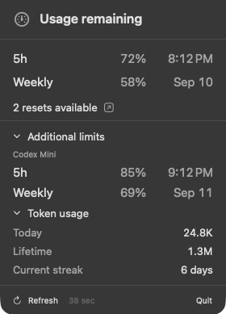
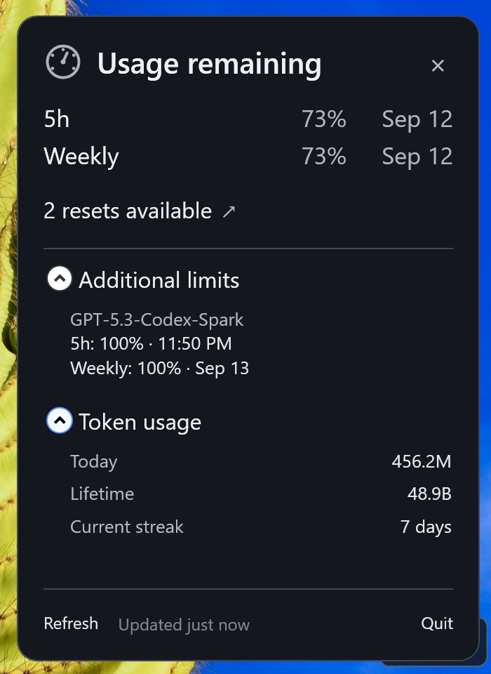

# ChatGPT Usage

> **Unsigned community software:** these downloads are not publisher-signed, and the Mac app is not notarized by Apple. Your operating system may warn or block installation. This project provides no guarantee that a download is safe. Only proceed if you trust the source and have verified the file. Read [Unsigned installation and security warnings](UNSIGNED-INSTALL.txt) for the app-specific **Open Anyway** (Mac) and **More info → Run anyway** (Windows) steps. Do not disable system-wide security protections.

A lightweight macOS menu-bar and Windows tray companion for viewing Codex usage. Both apps show the remaining percentage in the active five-hour window, weekly limits, reset times, available resets, extra model limits, token totals, refresh controls, and a direct link to the ChatGPT usage dashboard.

On macOS, click the menu-bar item to open the usage menu or double-click it to open the ChatGPT desktop app. On Windows, the percentage stays visible in a floating widget near the clock; click the widget or tray icon to open the full usage popup.

This is an unofficial local companion and is not distributed by OpenAI.

The apps launch a local `codex app-server` process and reuse Codex's existing ChatGPT sign-in. They do not read, copy, or store authentication tokens.

## Screenshots

<table>
  <tr>
    <th>macOS menu</th>
    <th>Windows popup</th>
  </tr>
  <tr>
    <td valign="top"></td>
    <td valign="top"></td>
  </tr>
  <tr>
    <th>macOS menu bar</th>
    <th>Windows widget</th>
  </tr>
  <tr>
    <td valign="top"></td>
    <td valign="top"></td>
  </tr>
</table>

## Download and install

[Download the latest release](https://github.com/asetho/ChatGPT-Usage/releases/latest), including the matching `.sha256` file for your package.

| Platform | Package | Requirements |
| --- | --- | --- |
| macOS | `ChatGPTUsage-<version>.dmg` | macOS 13 or later; Apple silicon or Intel |
| Windows | `ChatGPTUsage-Setup-<version>.exe` | x64-compatible Windows |

Both platforms require a working Codex CLI signed in to ChatGPT under the same user account. The macOS app can also use the CLI bundled with the ChatGPT desktop app.

### macOS

1. Download the DMG and its matching `.dmg.sha256` file.
2. Verify the download from the directory containing both files:

   ```sh
   shasum -a 256 -c ChatGPTUsage-<version>.dmg.sha256
   ```

3. Open the DMG and copy **ChatGPT Usage** to Applications.
4. Try opening the app once. If macOS blocks the unsigned app, follow the app-specific **Open Anyway** steps in [UNSIGNED-INSTALL.txt](UNSIGNED-INSTALL.txt). Do not disable Gatekeeper.

### Windows

1. Download the setup executable and its matching `.exe.sha256` file.
2. Verify the download in PowerShell and compare the complete result with the checksum file:

   ```powershell
   Get-FileHash .\ChatGPTUsage-Setup-<version>.exe -Algorithm SHA256
   ```

3. Run the installer. If Codex CLI is missing, setup explains the requirement and offers to run OpenAI's current official installer. You can decline and install Codex yourself.
4. Sign in to Codex separately if needed. The companion launches after setup and starts automatically when you sign in to Windows.

For platform-specific unsigned-app warnings and checksum guidance, read [UNSIGNED-INSTALL.txt](UNSIGNED-INSTALL.txt). A matching checksum detects a mismatched download; it is not a publisher signature or malware scan.

## Privacy and limitations

The optional Windows Codex installation downloads and runs OpenAI's current installer over HTTPS, so its contents can change independently of this app. Only set `CODEX_EXECUTABLE` to a binary you trust.

Both apps check this repository's latest published GitHub release at launch and every 12 hours while running. When a newer version exists, the popup provides a link to its release page; failed checks are silent.

See [Privacy](PRIVACY.md) for local data and subprocess behavior, and [Security](SECURITY.md) for reporting concerns. The app uses experimental Codex API capabilities; compatibility can change when Codex updates. Usage figures may be unavailable or stale and should be confirmed in the official dashboard.

## Build from source

### macOS

```sh
scripts/build-macos-dmg.sh
```

Requires Xcode and [XcodeGen](https://github.com/yonaskolb/XcodeGen). The script creates `dist/ChatGPTUsage-<version>.dmg` and its checksum.

### Windows

Run from PowerShell:

```powershell
scripts\build-windows-installer.ps1
```

Requires the .NET 8 SDK and Inno Setup 6. The script creates `Windows/dist/ChatGPTUsage-Setup-<version>.exe` and its checksum.

### Versioning and packages

`VERSION` is the release version for both platforms. The Windows build generates the executable and Start-menu icon from the same ChatGPT tray mark. Both platform packages remain unsigned community builds; no paid signing service or certificate is required by these scripts.

The installation warning is included in the DMG and displayed before Windows setup installs the app. Build scripts normally retain the three newest packages and their checksums. To preserve existing packages during local verification, use `KEEP_OLD_PACKAGES=1 scripts/build-macos-dmg.sh` or `scripts\build-windows-installer.ps1 -KeepOldPackages`.

Before publishing, follow the [release checklist](RELEASE-CHECKLIST.md). Building locally does not publish a release.

## License

The project source is available under the [MIT License](LICENSE), copyright 2026 `asetho™`. See the [trademark notice](TRADEMARKS.md) for `asetho` branding, third-party marks, and legal information. The license covers only material the copyright holder has authority to license; third-party names, trademarks, and artwork remain subject to their respective owners' rights.
